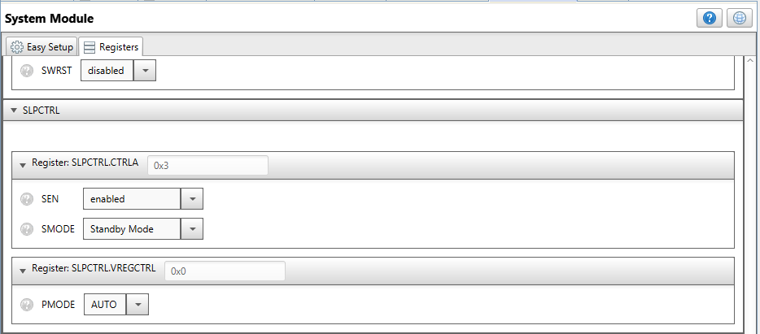
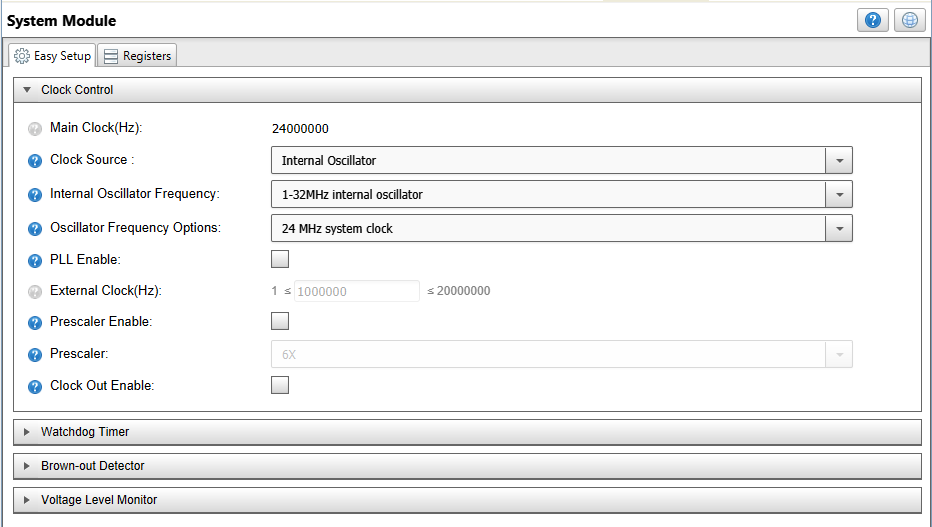
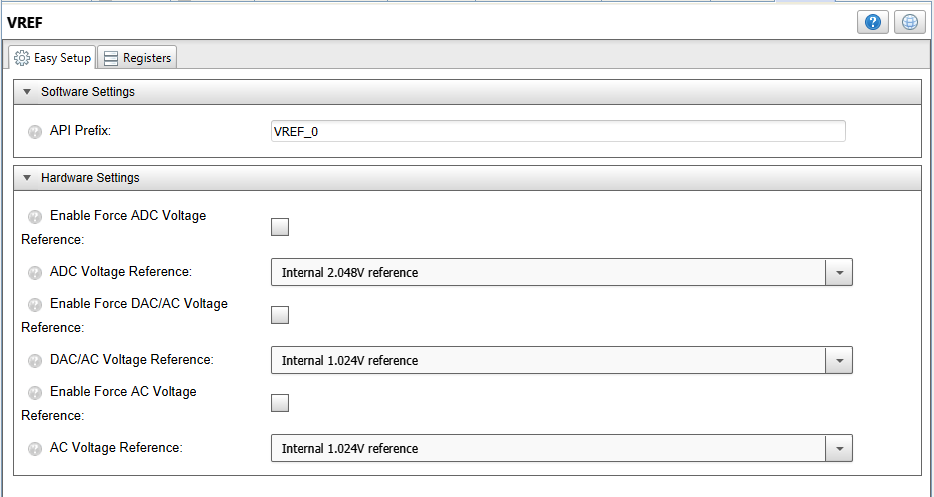
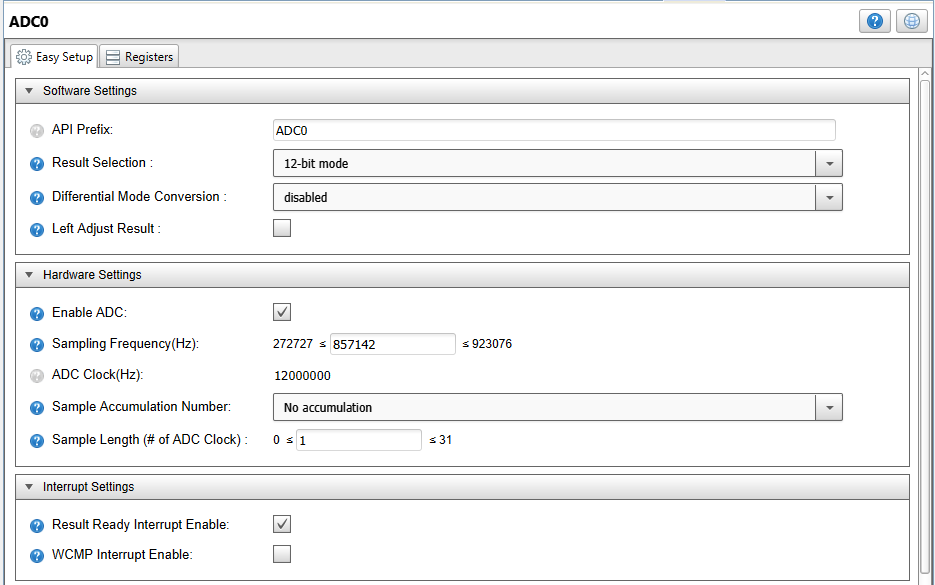
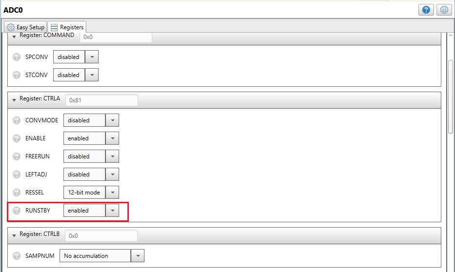
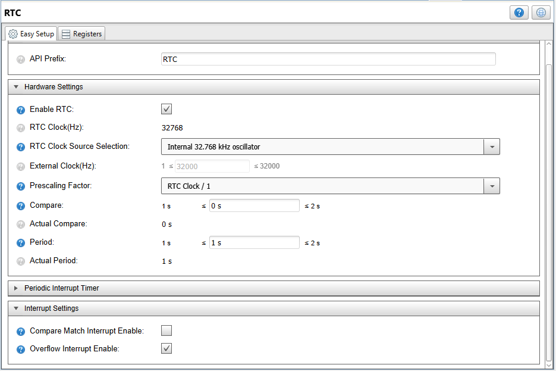
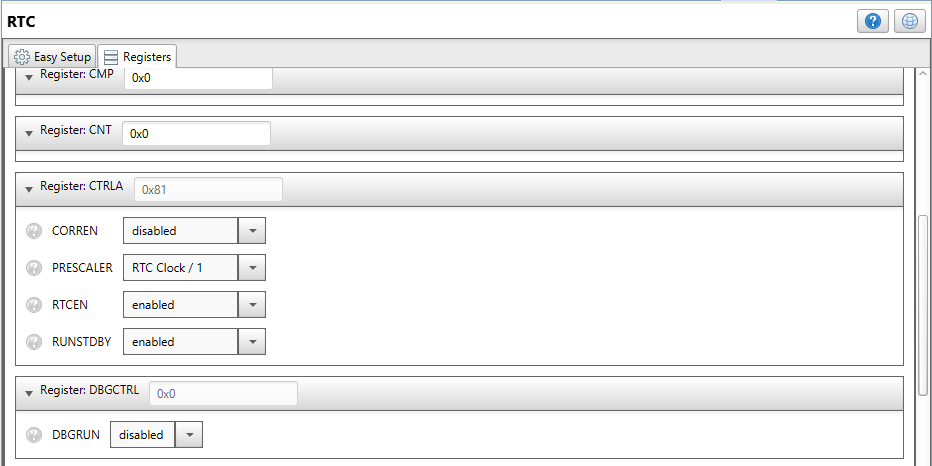
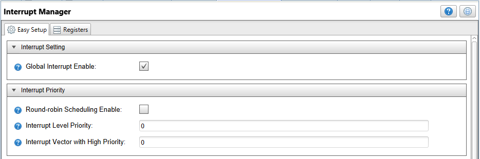

[](https://www.microchip.com)

# AVR DA family training - Low Power Using ADC and Interrupts

This repository provides a MPLAB X IDE project with a MCC (MPLAB Code Configurator) generated code example for starting ADC conversion on the temperature channel with interrupts. 

## Related Documentation
More details and code examples on the AVR128DA48 can be found at the following links:
- [Low-Power Modes Using Curiosity Nano - AVR DA Training Manual](http://www.microchip.com/DS40002243A.pdf)
- [AVR128DA48 Product Page](https://www.microchip.com/wwwproducts/en/AVR128DA28)
- [AVR128DA48 Code Examples on GitHub](https://github.com/microchip-pic-avr-examples?q=avr128da48)
- [AVR128DA48 Project Examples in START](https://start.atmel.com/#examples/AVR128DA48CuriosityNano)

## Software Used
- MPLAB® X IDE 5.40 or newer [(microchip.com/mplab/mplab-x-ide)](http://www.microchip.com/mplab/mplab-x-ide)
- MPLAB® XC8 2.20 or newer [(microchip.com/mplab/compilers)](http://www.microchip.com/mplab/compilers)
- MPLAB® Code Configurator (MCC) 3.95.0 or newer [(microchip.com/mplab/mplab-code-configurator)](https://www.microchip.com/mplab/mplab-code-configurator)
- AVR-Dx_DFP 1.1.40 or newer Device Pack
- 8-bit AVR MCUs Lib version 2.3.0

## Hardware Used
- AVR128DA48 Curiosity Nano [(DM164151)](https://www.microchip.com/Developmenttools/ProductDetails/DM164151)

## Setup
The AVR128DA48 Curiosity Nano Development Board is used as test platform.
<br>

The following MCC configurations must be made for this project:

 - System Module
    1. Internal Oscillator (24 MHz)
    2. Prescaler disabled
    3. WDT disabled
	4. Sleep enabled and set to Standby mode

<br>
<br>


- VREF module
	1. ADC Voltage reference: Internal 2.048V reference (this enables the temperature sensor)
	
<br>

- ADC 
	1. 12-bit mode
	2. No accumulation
	3. Sample Length: 1
	4. Run in standby enabled
	5. Result Ready interrupt enabled
	
<br>
<br>	
	
- RTC 
	1. Period configured for 1 second
	2. Run in standby enabled
	3. Overflow interrupt enabled
	
<br>	
<br>
	
- Interrupt manager
	1. Global interrupts enabled
	
<br>

## Demo Code 

The source code for this project can be downloaded from the current page by clicking the "Download" button, or if you want to make your own project, please pay attention to the following steps:
 - After making the MCC settings, press the "Generate" button, and this will generate the required .c and .h files.
 - Then edit the resulting code by adding the following code snippets.
    
	In the "main.c" file, replace the code with the following: 

    ```
    #include <avr/io.h>
    #include <avr/sleep.h>
    #include "mcc_generated_files/mcc.h"

    void Timer_interrupt(void);

    uint16_t result;	

    int main(void)
    {
        SYSTEM_Initialize();
        RTC_SetOVFIsrCallback(Timer_interrupt);
        while (1){
            sleep_cpu();
            result = ADC0_GetConversionResult();
        }
    }

    void Timer_interrupt()
    {
        ADC0_StartConversion(ADC_MUXPOS_TEMPSENSE_gc);
    }
    ```


## Operation

1. Connect the AVR128DA48 Curiosity Nano Development Board to PC using the USB cable.
2. Build the firmware and load the generated hex file into MCU.


## Demo:

After the code has been compiled and loaded onto the device, the microcontroller will read the temperature channel whenever it receives an interrupt from the timer and then enter sleep.

## Summary
This example represents one of the codes for the AVR DA low power lab manual.